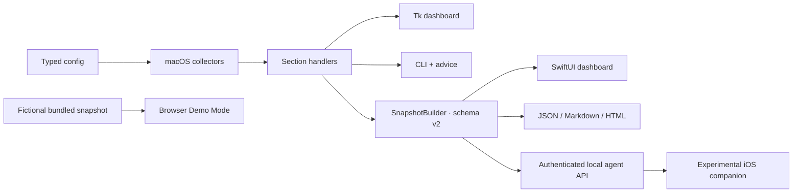

# Mac Health Checkup

Local-first macOS diagnostics with a native SwiftUI dashboard, a lightweight Tk interface, a browser-only Demo Mode,
automation-friendly snapshots, and an optional paired iOS companion.

**[Explore the complete interactive Demo Mode](https://mac-health-checkup.young-hen-7947.chatgpt.site)** — fictional
data only; the website cannot inspect or change the visitor's Mac.

[](https://github.com/hydroLB/Mac_Health_Checkup/actions/workflows/ci.yml)




> Product illustration with fictional sample values—not a runtime screenshot. The application always shows signals
> collected from the Mac on which it is running.

## Why This Project Matters

macOS exposes useful health signals across command-line tools, System Settings, IOKit, and privileged utilities.
Mac Health Checkup turns those fragmented, failure-prone sources into one explainable result for personal checks,
support workflows, regression comparisons, and native clients. Unavailable data remains visible as unknown or warning
state instead of being guessed healthy.

## Highlights

- One diagnostics layer feeds the CLI and Tk dashboard directly, then a versioned snapshot boundary serves SwiftUI,
  reports, automation, the local agent API, the iOS companion, and a deliberately fictional web snapshot.
- Collectors are best-effort and bounded: one restricted command degrades one signal instead of crashing the checkup.
- Privacy defaults are enforceable: no telemetry, API off by default, outbound capacity testing opt-in, TLS required
  for one-click LAN access, and an explicit safe-share redaction mode.
- The repository is governed by strict typing, layer checks, generated config documentation, hash-locked dependencies,
  branch coverage, security scans, and macOS/iOS build gates.
- Snapshot caching, section-level refresh, rate limiting, auth throttling, structured redacted logs, and deterministic
  failure handling provide concrete production-engineering discussion points.
- The Tk fallback collects diagnostics on a single background worker and replays buffered render operations on the
  UI thread, keeping slow macOS commands from freezing navigation or shutdown.

## Tech Stack

| Layer | Technology |
| --- | --- |
| Diagnostics and automation | Python 3.11+ standard library with a pinned local development runtime |
| Desktop interfaces | Native SwiftUI macOS app plus a dependency-free Tkinter fallback |
| Browser showcase | React Demo Mode with fictional in-browser data and no diagnostic, export, or telemetry access |
| Mobile companion | SwiftUI iOS client, URLSession transport, Keychain token storage, and certificate pinning |
| Contracts and delivery | JSON snapshot schema v2, authenticated HTTP agent, setuptools wheel/sdist, Swift Package Manager |
| Quality engineering | pytest/coverage, Ruff, strict mypy, Bandit, pip-audit, detect-secrets, pip-tools, and GitHub Actions |

## Quick Start

Requirements: macOS, Git, Make, and Python 3.11.x with Tkinter.

```sh
git clone https://github.com/hydroLB/Mac_Health_Checkup.git
cd Mac_Health_Checkup
make setup
make run
```

`make run` launches the Tk dashboard and is the lowest-friction UI path. To launch the native SwiftUI dashboard:

```sh
make dev
```

The SwiftUI build needs a Swift toolchain. Full Xcode is required for Swift package tests and the iOS build.

The native and browser Overview shows only warnings and critical health alerts, with critical alerts first. Healthy and unknown readings remain available from the sidebar; card previews contain only alert metrics.

## Interfaces

| Interface | Command | Purpose |
| --- | --- | --- |
| Web Demo Mode | [Open the public showcase](https://mac-health-checkup.young-hen-7947.chatgpt.site) | Complete interactive product tour using fictional data; it cannot inspect the visitor's Mac or download reports. |
| SwiftUI dashboard | `make dev` or `.venv/bin/python run.py` | Native macOS sidebar, section health, settings, refresh history, and cached startup state. |
| Tk dashboard | `make run` | In-process desktop UI with cards, tables, keyboard focus, tooltips, and bounded background refresh. |
| CLI | `.venv/bin/python -m mac_health_checkup --cli --advice` | Human-readable terminal summary with status-aware next steps. |
| Snapshot JSON | `.venv/bin/python -m mac_health_checkup --snapshot-json` | Versioned machine contract for native frontends and automation. |
| Agent API | `.venv/bin/python run.py --agent` | One-click headless server with generated auth and fail-closed LAN/TLS behavior. |
| iOS companion | Open `ios/MacHealthCheckupMobile/MacHealthCheckupMobile.xcodeproj` | Experimental, source-only paired client; requires a developer team and a reachable HTTPS Mac agent. |

The repository is currently source-first: Demo Mode is hosted publicly, but there is no signed/notarized macOS app
bundle, App Store build, or tagged binary release. The website's download control remains unavailable until the full
application meets that release bar.

## What It Checks

| Area | Signals |
| --- | --- |
| Performance | IOHID temperature sensors and component power when macOS permits access |
| System | model, chip, OS, disk free, memory free, and top CPU/memory processes |
| Security | FileVault, System Integrity Protection, Gatekeeper, and firewall posture |
| Maintenance | Time Machine recency, software updates, and startup items |
| Hardware | adapter/battery data, fans, SSD health, displays, USB/Thunderbolt tree, and input devices |
| Network | active interface, local IP, Wi-Fi signal/link rate, and live interface byte rates |

Collector availability varies by Mac model, macOS release, permissions, virtualization, and installed helper tools.
The UI reports those limitations; it does not fabricate missing values.

### Optional Capabilities

| Tool or access | Adds | Behavior when absent |
| --- | --- | --- |
| `smartctl` from smartmontools | Detailed SSD SMART/NVMe health | SSD health is reported unavailable. |
| `istats` | Additional fan-speed fallback | Built-in sources are tried; fan speed may remain unavailable. |
| Privileged `powermetrics` access | CPU/GPU/ANE power | Performance retains any accessible thermal data and warns on missing power. |
| `qrencode` | Terminal pairing QR | The JSON pairing payload is still printed. |
| `openssl` | One-click self-signed TLS material | Agent falls back to loopback-only HTTP; iOS LAN pairing stays disabled. |
| Full Xcode | XCTest and unsigned iOS build validation | Python checks and `swift build` remain available with supported command-line tools. |

## Architecture



The important boundary is the section handler/snapshot contract—not a second collector implementation in every UI.
Python owns macOS command execution and normalization. Swift owns native presentation, refresh lifecycle, cache
policy, and remote transport.

## Engineering Decisions

| Decision | Rationale |
| --- | --- |
| Local-first execution | Device health data stays on the Mac unless the user explicitly starts a paired agent or shares an export. |
| Fail-soft collectors | Restricted or missing commands should produce partial, actionable results rather than a blank application. |
| Snapshot boundary | Native clients consume one validated schema instead of duplicating macOS parsing and health policy. |
| Typed, generated configuration docs | Runtime policy remains reviewable while parser/model drift is caught in CI. |
| Hash-locked tooling | Local and CI checks evaluate the same dependency graph; lock verification is non-mutating. |
| Last-known-good native cache | Failed or partial refreshes remain visible without replacing a valid full snapshot. |
| Buffered Tk refresh | Collectors run away from Tk while typed render operations replay on the UI thread in order. |

## Privacy And Security

- There is no analytics or telemetry pipeline.
- Routine collection stays local and the configured API is disabled by default.
- `network.capacity_test_enabled` defaults to `false`. Enabling it runs macOS `networkQuality`, which sends test
  traffic to external measurement endpoints; capacity results are cached for at least the configured interval.
- The one-click agent exposes LAN access only when TLS material is ready. TLS failure binds to loopback instead of
  enabling insecure HTTP on the network.
- Auth tokens are generated or supplied through environment variables, weak defaults are rejected, requests are
  throttled, remote clients reject cleartext non-loopback transport, and generated tokens, exports, and caches use
  owner-only permissions.

Snapshots can contain a hardware serial, local IP, Wi-Fi SSID, process IDs, command paths, and raw diagnostics. Use
`--redact-sensitive` before sharing and still review the output for context-specific identifiers.

See [`SECURITY.md`](SECURITY.md) for the threat model and reporting path.

## Reports And Automation

```sh
# Human-readable reports
.venv/bin/python -m mac_health_checkup --export markdown
.venv/bin/python -m mac_health_checkup --export html --redact-sensitive

# Save and compare snapshots
.venv/bin/python -m mac_health_checkup --snapshot-json-out /tmp/before.json
.venv/bin/python -m mac_health_checkup --snapshot-json-out /tmp/after.json
.venv/bin/python -m mac_health_checkup --diff-snapshots /tmp/before.json /tmp/after.json

# Produce a safer file for support or portfolio review
.venv/bin/python -m mac_health_checkup --snapshot-json-out /tmp/share.json --redact-sensitive

# Fail automation on warn or bad sections
.venv/bin/python -m mac_health_checkup --snapshot-json --fail-on warn >/tmp/snapshot.json
.venv/bin/python -m mac_health_checkup --cli --fail-on bad
```

Redaction is opt-in so local diagnostic fidelity and backwards compatibility remain unchanged.
It is schema-aware rather than a general PII detector: executable basenames remain visible, raw diagnostic blobs are
replaced wholesale, and sensitive-only changes intentionally disappear from redacted diffs.

## Agent Pairing

iOS cannot run macOS collectors. Start the explicit one-click agent, then paste its JSON pairing payload into the
source-built iOS client:

```sh
.venv/bin/python run.py --agent
```

The runner generates a strong token and attempts self-signed TLS. If TLS setup succeeds, it prints a LAN HTTPS URL;
otherwise it serves loopback only and explains why iOS pairing is unavailable. Manual API settings are documented in
[`docs/config_reference.md`](docs/config_reference.md).

## Configuration

The checked-in defaults live in `config/config.json`; installed wheels carry the same validated default config.
Override the source with `MAC_HEALTH_CHECKUP_CONFIG=/absolute/path/config.json`. Secrets belong in environment
variables such as `MAC_HEALTH_CHECKUP_API_AUTH_TOKEN`, not committed JSON.

`.env.example` documents supported variables; the application does not silently load dotenv files. Export values in
the invoking shell or process manager. When checked-in defaults change, run `make config-sync` to update the packaged
copy and `make config-ref` to regenerate the reference; both are verified by `make check-python`.

The complete generated key/type/default reference is in
[`docs/config_reference.md`](docs/config_reference.md).

## Development Workflow

```sh
make setup          # Python 3.11 venv, hash-locked tools, managed Git hooks
make check-python   # dependencies, hygiene, lint, format, mypy, docs, tests, security
make check          # Python gate + benchmarks + Swift tests + unsigned iOS build
make showcase-check # install locked web dependencies, lint, and build Demo Mode
```

Focused commands:

```sh
make test
make lint
make format-check
make typecheck
make security
make bench
make build
make swift-test
make ios-build
```

`make check` is the CI contract. Apple-platform targets fail early with actionable preflight messages when full Xcode
or an iOS SDK is unavailable.

### Testing Strategy

- Python unit/integration tests cover parsing, config concurrency, CLI modes, report export, API auth/throttling,
  disconnect behavior, GUI helpers, shell boundaries, and repository tooling.
- Branch coverage is enforced for the backend and typed config boundary with a checked-in minimum threshold.
- Swift package tests cover config decoding, backend transport, launch args, view-model helpers, health mapping, and
  snapshot encode/decode symmetry.
- A dependency-free PPM layout-model tool exercises resize, focus, scroll, overflow, refresh-error, and recovery math.
  It is deterministic model-level regression coverage, not a live Tk/SwiftUI screenshot test.
- Parser microbenchmarks use representative multiline fixtures and process CPU time so shared-runner scheduling does
  not masquerade as a product regression.

```sh
make visual-capture-baseline
make visual-capture-candidate
make visual-diff
```

## Distribution And Deployment

Deployment is local by design: run from a source checkout or install the Python surfaces into a private environment.
No package is published to PyPI, but the repository can build and install a wheel locally:

```sh
make build
python3.11 -m venv /tmp/mac-health-checkup-wheel
/tmp/mac-health-checkup-wheel/bin/pip install dist/mac_health_checkup-*.whl
(cd /tmp && /tmp/mac-health-checkup-wheel/bin/mac-health-checkup --help)
```

`make build` creates both a wheel and source distribution after verifying that the packaged default configuration is
in sync. This installs the Python CLI/Tk/snapshot surfaces; SwiftUI and iOS remain source-built platform targets.

## Documentation

| Document | Scope |
| --- | --- |
| [`docs/repository-layout.md`](docs/repository-layout.md) | Current paths, supported entrypoints, and ownership. |
| [`docs/public-api-boundaries.md`](docs/public-api-boundaries.md) | Supported imports and internal Python modules. |
| [`docs/config_reference.md`](docs/config_reference.md) | Generated config keys, types, defaults, and overrides. |
| [`CONTRIBUTING.md`](CONTRIBUTING.md) | Local workflow and contribution standards. |
| [`SECURITY.md`](SECURITY.md) | Security controls, privacy boundaries, and vulnerability reporting. |
| [`RELEASE.md`](RELEASE.md) | Honest source/package release readiness and native artifact gaps. |
| [`CHANGELOG.md`](CHANGELOG.md) | Unreleased work and historical development milestones. |

## Roadmap

- Build a signed, notarized macOS app bundle with checksums and a repeatable release artifact workflow.
- Add an iOS test target, app icons, and a documented pairing demo.
- Add real runtime UI screenshot regression coverage with reviewed, committed baselines.
- Expand redaction policy and sampled snapshot fixtures across representative Mac hardware.
- Replace remaining broad entrypoint wrappers with smaller dependency objects where that improves navigation.

## Design Tradeoffs Worth Inspecting

- How one set of fallible macOS collectors supports in-process and cross-language interfaces without duplicating
  parsing policy.
- Why partial data, explicit unknown state, and configurable fail thresholds are better than all-or-nothing health
  checks.
- How local-first defaults translate into concrete controls: opt-in traffic, fail-closed LAN exposure, token hygiene,
  redacted logs, safe-share exports, and certificate pinning.
- How non-behavior quality gates—layer rules, generated docs, lock idempotence, secret scanning, package smoke tests,
  and platform preflights—make maintenance claims defensible.

## License

MIT. See [`LICENSE`](LICENSE).
